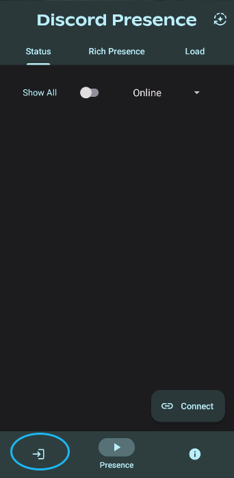
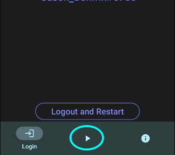
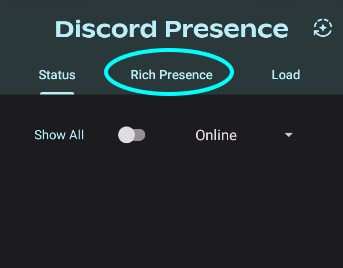

# Discord-Rich-Presence-Android
Discord Rich Presence for Android

# How do I install?
Go to latest [releases](https://github.com/JasonBenfrin/Discord-Rich-Presence-Android/releases) and download the latest apk
Then install

# What can this do?
It can set Rich Presence from your Android phone or tablet! **Now with Buttons!**

# I'm confused, where do I start?
1. When you open the app for the first time, click this icon on the bottom left

   

2. Then Click the login button and Login

   _Note: if your phone is rooted, I should warn you that you are putting sensitive information and as your phone is not safe, your token can be leaked_

3. After you have logged in, click the bottom middle icon which is where you what you see when you open the app.

   

4. Then click the Rich Presence Tab on the top

   

5. Then switch on the Activity switch and you can Customize it!

# I'm still confused, help!
You can join my server and ask for help, request features and get updates on the app! [Join my Discord](https://discord.gg/MJWCFuQqXv)
